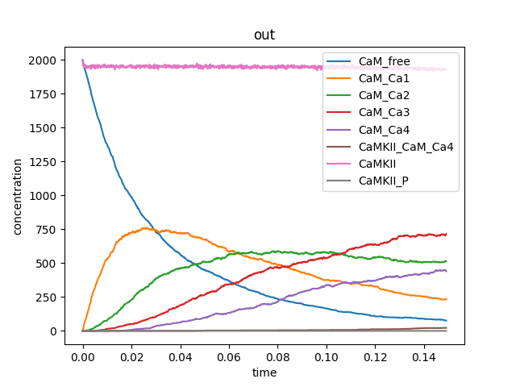

# How to run this repo's files in your own local machine to reproduce results

In order to run the files in this repo, you will need a few requirements first:

## 1. Install  MCell/CellBlender v4.0.6 bundle with Blender 2.93
The CellBlender bundle containing MCell4 is available for download for different operating systems at the MCell.org website: https://mcell.org/download.html


As of 20230428 I used MCell/CellBlender v4.0.6 bundle with Blender 2.93, on Windows 10 to run this code.

As of 20230501 MCell MacOS Download isn't compatible with "Apple Silicone" devices; it looks like MCell is incompatible with the latest Mac hardware, which uses Arm chips.

I use VS Code as my IDE (Integrated development environment), but you can use whichever IDE you prefer. 

-  To save time and computational power, I run MCell4 outside of Blender.

-  To use MCell4 outside of Blender with Python 3.9, additional installation steps are required as described below:

## 2. Setting System Variable MCELL_PATH and adding Python 3.9 to PATH

### 2.1. Depending on your OS:
- In order to set the System Variable MCELL_PATH, depeding on your Operating System, please follow the instructions here: https://mcell.org/mcell4_documentation/installation.html#setting-system-variables

### 2.2. Why do you need to do this:

As per the mcell documentation, MCell4 Python models use the system variable MCELL_PATH to locate the MCell4 library. It is also useful as a shortcut to the location of utility scripts contained in the CellBlender bundle.

MCell4 also requires Python 3.9. You can either use you own installation or set the system variable PATH so that the Python included in the CellBlender bundle is found.

The models generated by CellBlender expect a system variable MCELL_PATH to be defined and use it to add this path (appended with ‘lib’) to the Python’s search paths like this: 

This is specified in the [mcell_hexamer.py](./mcell_hexamer.py#L5) file. 

```python
MCELL_PATH = os.environ.get('MCELL_PATH', '')
sys.path.append(os.path.join(MCELL_PATH, 'lib'))

import mcell as m
```

## 3. Set up an environment

In order to make sure we are both working with the same versions of python and dependencies required to run the python script in this repo, it will be useful to create an environment.

With a virtual environment, it’s possible to retain all the information in our projects like the dependencies, so anyone else can duplicate the same environment we’re working with.

### 3.1. If you have conda (the environment management system I use): 

You can use the [environment.yml](./environment.yml) file in this repo, and create an environment with the following command:

```
conda env create --file environment.yml
```

This will create an environment called *'camkii-project-env'*. Then activate the environment and run the [mcell_hexamer.py](./mcell_hexamer.py) file there.

PS. I have found [these carpentries](https://carpentries-incubator.github.io/introduction-to-conda-for-data-scientists/) quite helpful with queries regarding conda environments, if you need some guidance here. 

### 3.2. If you use a different environment manager:

You will likely need to use the [requirements.txt](./requirements.txt) file instead. 

The commands to create and activate an environment using virtualenv, pipenv, venv, pyenv, etc will be different depending on which one you use. As an example, if you were using [venv](https://docs.python.org/3/library/venv.html), then you would need to do something like this:

```virtualenv my-env ``` to create your new environment (called 'my-env' here)

```source my-env/bin/activate``` to enter the virtual environment

```pip install -r requirements.txt``` to install the requirements in the current environment

## 4. Running the code and expected output

Once you are set up with the above requirements, you can run the python script [mcell_hexamer.py](./mcell_hexamer.py) in your terminal.

```
python mcell_hexamer.py 
```

It takes about 10min to run in my machine.

(specs: Processor 11th Gen Intel(R) Core(TM) i5-1145G7 @ 2.60GHz   1.50 GHz, System type 64-bit operating system, x64-based processor, 16GB RAM)

The output in the terminal should look something like this:

```
$ python mcell_hexamer.py 
Import of MCell was sucessful
Initializing 27000 waypoints... 
Partition contains 30^3 subpartitions, subpartition size is 0.05 microns.
Copyright (C) 2006-2021 by
  The National Center for Multiscale Modeling of Biological Systems,
  The Salk Institute for Biological Studies, and
  Pittsburgh Supercomputing Center, Carnegie Mellon University,

**********************************************************************
MCell development is supported by the NIGMS-funded (P41GM103712)
National Center for Multiscale Modeling of Biological Systems (MMBioS).
Please acknowledge MCell in your publications.
**********************************************************************

Generated file data_layout.json for plotting in CellBlender.
Iterations: 0 of 3000
Released 10000 Ca@CP from "Release of Ca@CP at CP" at iteration 0.
Released 2000 CaM(ca~0,camkii)@CP from "Release of CaM(ca~0,camkii)@CP at CP" at iteration 0.
Released 2000 @CP:CaMKII(active~0,T286~0,S306~0,cam,nmdar,l!1,r!2,c).CaMKII(active~0,T286~0,S306~0,cam,nmdar,l!3,r!1,c).CaMKII(active~0,T286~0,S306~0,cam,nmdar,l!4,r!3,c).CaMKII(active~0,T286~0,S306~0,cam,nmdar,l!5,r!4,c).CaMKII(active~0,T286~0,S306~0,cam,nmdar,l!6,r!5,c).CaMKII(active~0,T286~0,S306~0,cam,nmdar,l!2,r!6,c) from "Release of @CP:CaMKII(active~0,T286~0,S306~0,cam,nmdar,l!6,r!1,c).CaMKII(active~0,T286~0,S306~0,cam,nmdar,l!1,r!2,c).CaMKII(active~0,T286~0,S306~0,cam,nmdar,l!2,r!3,c).CaMKII(active~0,T286~0,S306~0,cam,nmdar,l!3,r!4,c).CaMKII(active~0,T286~0,S306~0,cam,nmdar,l!4,r!5,c).CaMKII(active~0,T286~0,S306~0,cam,nmdar,l!5,r!6,c) at CP" at iteration 0.
Released 0 PP1@CP from "Release of PP1@CP at CP" at iteration 0.
Released 400 NMDAR(camkii)@PM from "Release of NMDAR(camkii)@PM at PM" at iteration 0.
Iterations: 100 of 3000 (3.46508 iter/sec) [active/total species 19/25, rxn classes 25, active/total reactant classes 8/8]
Iterations: 200 of 3000 (3.62197 iter/sec) [active/total species 19/25, rxn classes 25, active/total reactant classes 8/8]
[...]  
Iterations: 3000 of 3000 (5.47416 iter/sec) [active/total species 36/60, rxn classes 58, active/total reactant classes 8/8]     
Iteration 3000, simulation finished successfully
Total number of ray-subvolume intersection tests (number of ray_trace calls): 185680768
Total number of ray-polygon intersection tests: 752512295
Total number of ray-polygon intersections: 28199573
Total number of mol reflections from a wall: 13771810
Total number of vol mol vol mol collisions: 2835464
Total number of molecule moves between walls: 160272
Total number of usages of waypoints for counted volumes: 0
Total number of counted volume recomputations: 143638840
Total number of diffuse 3d calls: 171908958
Average diffusion jump was: 0.170364 timesteps  (2.94916e+07/173108958)
Simulation CPU time = 742 (user) and 3.5 (system)
Simulation CPU time without iteration 0 = 741.672 (user) and 3.45312 (system)
```
Running this code will overwrite the [out.gdat](./out.gdat) file originally downloaded in the repo. However, you should still get an output that looks similar to this:



Image: [out_gdat.png](./out_gdat.png)

Note: This output is obtained from running the model with:

ITERATIONS = 3e3 (defined in [hexamer_20220624.bngl](./hexamer_20220624.bngl#L15))

model.config.time_step = 1e-4 (defined in [mcell_hexamer.py](./mcell_hexamer.py#L52))
